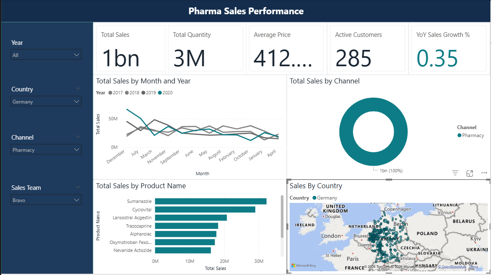
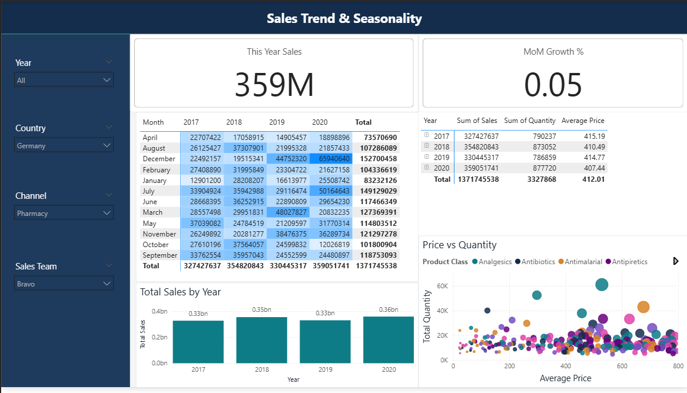

# Pharmaceutical Sales Performance Dashboard

A business intelligence dashboard built using **Power BI** to analyze pharmaceutical sales performance across products, customers, sales teams, channels, and geographic regions.

The project demonstrates how business analytics can transform raw sales data into actionable insights that support strategic decision-making.

---

## Project Overview

This dashboard provides an executive-level overview of pharmaceutical sales by tracking revenue, quantity sold, customer activity, pricing trends, sales growth, and regional performance.

The analysis helps answer business questions such as:

- Which products generate the highest sales?
- Which sales teams perform the best?
- How do sales vary across countries and channels?
- What are the monthly and yearly sales trends?
- How are pricing and sales quantity related?

---

## Dashboard Pages

### Page 1 – Pharma Sales Performance

This dashboard focuses on overall business performance.

**KPIs**
- Total Sales
- Total Quantity Sold
- Average Price
- Active Customers
- Year-over-Year (YoY) Sales Growth

**Visualizations**
- Monthly Sales Trend
- Sales by Channel
- Top Selling Products
- Geographic Sales Distribution

---

### Page 2 – Sales Trend & Seasonality

This dashboard provides deeper trend analysis.

**KPIs**
- This Year Sales
- Month-over-Month (MoM) Growth

**Visualizations**
- Monthly Sales Matrix
- Sales Summary by Year
- Sales Trend by Year
- Price vs Quantity Analysis

---

## Features

- Interactive dashboard filters
- Dynamic KPI cards
- Time-based sales analysis
- Product performance analysis
- Customer analytics
- Geographic sales visualization
- Sales team performance tracking
- Channel-wise comparison
- Year-over-Year growth analysis
- Month-over-Month growth analysis

---

## Technologies Used

- Power BI
- Power Query
- DAX
- Python
- Pandas

---

## Project Structure

```
PHARMA_DASHBOARD
│
├── Dashboard
│   └── Pharma_Dashboard.pbix
│
├── Data
│   ├── pharma-data.csv
│   └── cleaned_pharma_sales.csv
│
├── Notebooks
│   └── clean_data.ipynb
│
├── photos
│   ├── page1.png
│   └── page2.png
│
├── .gitignore
└── README.md
```

---

## Data Preparation

The dataset was cleaned using Python before importing it into Power BI.

Cleaning steps included:

- Handling missing values
- Removing duplicate records
- Standardizing data types
- Creating a Date column for time intelligence
- Exporting a cleaned dataset for visualization

---

## DAX Measures

Some of the key measures used include:

- Total Sales
- Total Quantity
- Average Price
- Active Customers
- Previous Year Sales
- YoY Sales Growth %
- Previous Month Sales
- MoM Growth %
- This Year Sales

---

## Dashboard Preview

### Pharma Sales Performance



---

### Sales Trend & Seasonality



---

## Business Insights

The dashboard enables stakeholders to:

- Monitor overall pharmaceutical sales performance
- Identify high-performing products
- Compare sales across channels
- Evaluate sales trends over time
- Analyze customer activity
- Monitor regional performance
- Support strategic sales decisions

---

## Future Improvements

- Forecasting using Power BI
- Profit and margin analysis
- Customer segmentation
- Inventory analysis
- Market basket analysis
- Executive mobile dashboard
- Drill-through reports

---

## Author

**Samarth Patel**

GitHub: https://github.com/sampatel23