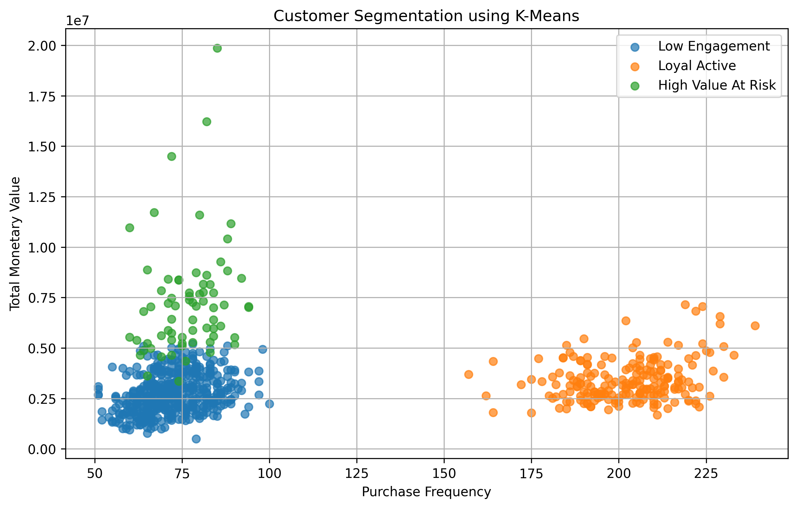
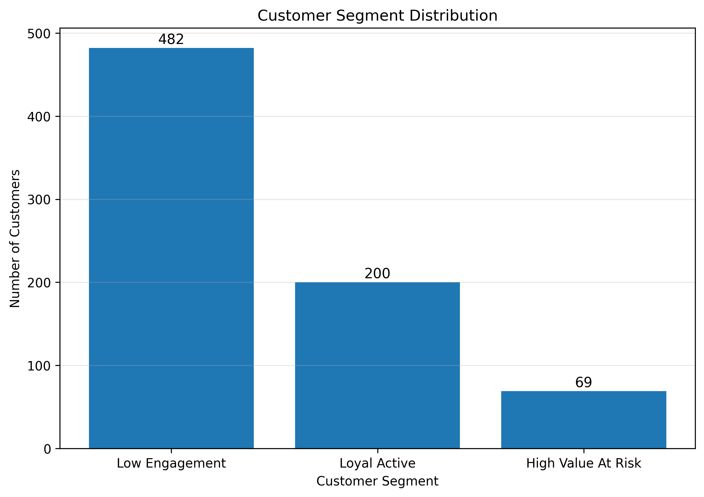
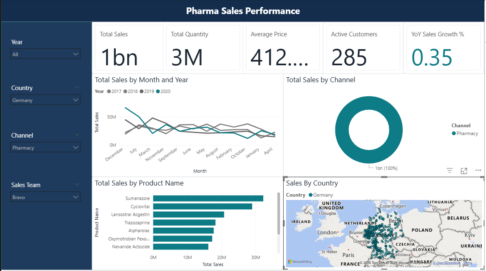
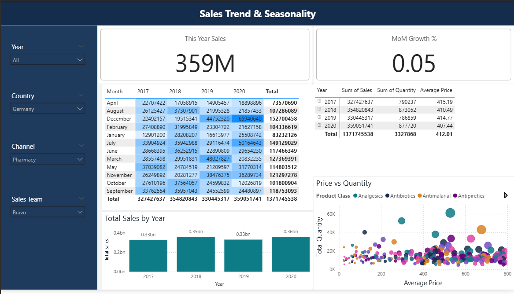
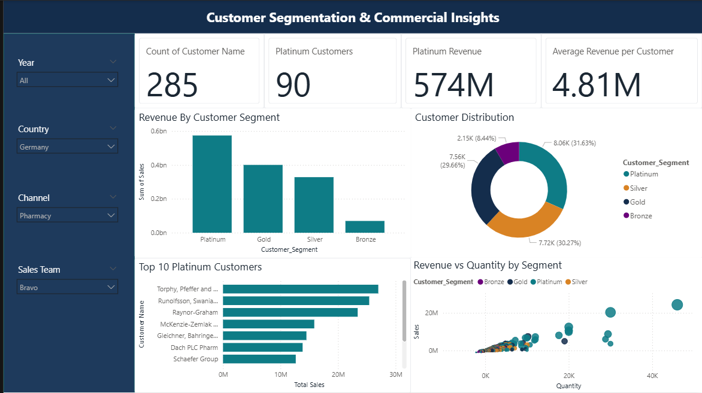
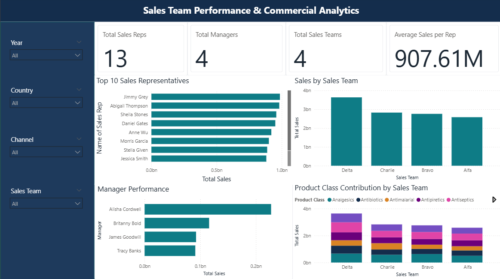

# 💊 Pharmaceutical Sales Analytics

An end-to-end pharmaceutical sales analytics project combining **Python, SQL, Power BI, and Machine Learning** to analyze sales performance, customer behavior, commercial performance, and customer segmentation.

---

## 📌 Project Overview

This project analyzes pharmaceutical sales transactions to uncover:

- Sales and revenue trends
- Product performance
- Customer behavior
- Sales representative performance
- Sales team performance
- Geographic sales patterns
- Rule-based customer segmentation
- ML-based customer segmentation
- High-value customers at risk of disengagement

The project follows an end-to-end analytics workflow:

```text
Raw Sales Data
      │
      ▼
Python Data Cleaning
      │
      ▼
SQL Business Analysis
      │
      ▼
Power BI Dashboard
      │
      ▼
ML Customer Segmentation
      │
      ▼
Business Insights & Recommendations
```

---

# 📊 Dashboard Pages

## Page 1 – Pharma Sales Performance

Executive dashboard providing an overview of overall business performance.

### KPIs

- Total Sales
- Total Quantity Sold
- Average Price
- Active Customers
- Year-over-Year (YoY) Sales Growth

### Visualizations

- Monthly Sales Trend
- Sales by Channel
- Top Selling Products
- Geographic Sales Distribution

---

## Page 2 – Sales Trend & Seasonality

Time-based sales analysis to identify trends and seasonality.

### KPIs

- This Year Sales
- Month-over-Month (MoM) Growth

### Visualizations

- Monthly Sales Matrix
- Sales Summary by Year
- Year-wise Sales Trend
- Price vs Quantity Analysis

---

## Page 3 – Customer Segmentation & Commercial Insights

Customer-focused commercial analytics using customer segmentation.

### KPIs

- Total Customers
- Platinum Customers
- Platinum Revenue
- Average Revenue per Customer

### Visualizations

- Revenue by Customer Segment
- Customer Distribution
- Top Customers by Revenue
- Geographic Sales Distribution

---

## Page 4 – Sales Team Performance & Commercial Analytics

Sales force performance analysis to support commercial decision-making.

### KPIs

- Total Sales Representatives
- Total Managers
- Total Sales Teams
- Average Sales per Representative

### Visualizations

- Top Sales Representatives
- Sales by Sales Team
- Manager Performance
- Product Class Contribution by Sales Team

---

# 🤖 Machine Learning – Customer Segmentation

A machine learning pipeline was developed as an extension of the business analytics workflow to identify customer groups based on purchasing behavior.

The ML pipeline uses **K-Means clustering** to discover customer behavioral patterns from historical purchasing data.

---

## 🧠 ML Pipeline

```text
Transaction-Level Sales Data
            │
            ▼
      Data Preparation
            │
            ▼
    Customer Aggregation
            │
            ▼
 RFM + Behavioral Features
            │
            ▼
      StandardScaler
            │
            ▼
       K-Means Clustering
            │
            ▼
    Silhouette Evaluation
            │
            ▼
       Optimal K = 3
            │
            ▼
   Customer Segment Profiles
            │
            ▼
 Business Recommendations
```

---

## 🔧 Features Used

Six customer-level features were created for clustering:

| Feature | Description |
|---|---|
| Recency | Number of days since the customer's most recent purchase |
| Frequency | Number of purchase transactions |
| Monetary | Total historical sales value |
| Product Diversity | Number of unique products purchased |
| Total Quantity | Total quantity purchased |
| Average Order Value | Average sales value per transaction |

---

# 🔬 Model Selection

Multiple K-Means configurations were evaluated using the **Silhouette Score**.

| Number of Clusters | Silhouette Score |
|---:|---:|
| 2 | 0.6250 |
| **3** | **0.6599** |
| 4 | 0.5501 |
| 5 | 0.5426 |
| 6 | 0.4712 |
| 7 | 0.3922 |

The optimal configuration was:

**K = 3**

with a **Silhouette Score of 0.6599**.

---

# 👥 ML Customer Segments

The model segmented **751 customers** into three behavioral groups.

| Segment | Customers | Avg. Recency | Avg. Frequency | Avg. Monetary Value |
|---|---:|---:|---:|---:|
| Low Engagement | 482 | 487 days | 72 | 2.75M |
| Loyal Active | 200 | 31 days | 202 | 3.40M |
| High Value At Risk | 69 | 488 days | 77 | 7.31M |

---

## 🔵 Low Engagement

**482 customers**

This is the largest customer segment.

These customers show relatively low recent engagement and lower purchasing activity compared with the Loyal Active segment.

### Recommended Action

- Launch targeted re-engagement campaigns
- Identify reasons for reduced purchasing activity
- Monitor changes in purchasing frequency
- Use targeted communication to encourage repeat purchases

---

## 🟠 Loyal Active

**200 customers**

These customers demonstrate strong and recent purchasing activity.

Key characteristics:

- Average recency of approximately **31 days**
- Highest purchase frequency among the three segments
- Consistent purchasing behavior

### Recommended Action

- Retention programs
- Loyalty initiatives
- Cross-selling and upselling
- Personalized product recommendations

---

## 🟢 High Value At Risk

**69 customers**

This is the most strategically important segment.

Although it represents a small portion of the customer base, these customers have the highest historical monetary value.

Key characteristics:

- Only **69 customers**
- Average recency of approximately **488 days**
- Average historical monetary value of approximately **7.31M per customer**
- Average order value of approximately **95K**

### Recommended Action

Prioritize these customers for **reactivation and retention campaigns**.

Potential actions include:

- Personalized sales-representative follow-up
- Targeted offers
- Product recommendations
- Direct customer engagement
- Monitoring for signs of renewed activity

---

# 📈 ML Visualizations

## Customer Segmentation



## Customer Segment Distribution



---

# 🔄 Two Customer Segmentation Approaches

The project contains two complementary approaches to customer segmentation.

## 1. Business Rule-Based Segmentation

The original analytics workflow uses predefined business rules based on:

- Total Sales
- Purchase Quantity
- Product Diversity

Customers are classified into:

- Platinum
- Gold
- Silver
- Bronze

This approach is useful for straightforward commercial reporting and Power BI dashboards.

---

## 2. ML-Based Segmentation

The machine learning pipeline uses:

- Recency
- Frequency
- Monetary Value
- Product Diversity
- Total Quantity
- Average Order Value

K-Means clustering then identifies behavioral groups automatically:

- Low Engagement
- Loyal Active
- High Value At Risk

This provides a more data-driven view of customer behavior.

---

# 🐍 Data Preparation

The dataset was prepared using Python before visualization and machine learning.

Processing steps included:

- Handling missing values
- Removing duplicate records
- Standardizing data types
- Creating a Date column
- Preparing the dataset for SQL analysis
- Creating customer-level features
- Customer segmentation
- Exporting cleaned datasets for Power BI

---

# 🗄️ SQL Analysis

SQL was used to perform business-focused analytical queries, including:

- Customer performance analysis
- Customer engagement analysis
- Sales representative performance
- Sales team analysis
- Manager performance analysis
- Product-level sales analysis

SQL analysis is implemented through the `sql_analysis.ipynb` notebook and SQLite database.

---

# 📐 Key DAX Measures

Some of the DAX measures used in the Power BI dashboard include:

- Total Sales
- Total Quantity
- Average Price
- Active Customers
- Previous Year Sales
- YoY Sales Growth %
- Previous Month Sales
- MoM Growth %
- This Year Sales
- Platinum Revenue
- Average Revenue per Customer
- Total Sales Representatives
- Average Sales per Representative

---

# 📊 Dashboard Preview

## Page 1 – Pharma Sales Performance



---

## Page 2 – Sales Trend & Seasonality



---

## Page 3 – Customer Segmentation & Commercial Insights



---

## Page 4 – Sales Team Performance & Commercial Analytics



---

# 💡 Key Business Insights

The combined analytics and machine learning workflow helps answer important business questions such as:

- Which products generate the highest revenue?
- Which customer segments contribute the most sales?
- Which customers are highly valuable but currently inactive?
- Which sales representatives are top performers?
- Which sales teams achieve the highest revenue?
- How does sales performance change over time?
- Which geographic regions contribute the most revenue?
- How can customer segmentation support commercial decision-making?

### Major ML Insight

The most actionable finding from the ML pipeline is the identification of **69 High Value At Risk customers**.

These customers have an average historical monetary value of approximately **7.31M per customer** while having an average recency of approximately **488 days**.

This makes them a high-priority target for customer reactivation strategies.

---

# 📁 Project Structure

```text
PHARMA_DASHBOARD
│
├── Dashboard
│   └── Pharma_Dashboard.pbix
│
├── Data
│   ├── cleaned_pharma_sales.csv
│   ├── customer_segmentation.csv
│   ├── pharma-data.csv
│   ├── pharma_segmented_new.csv
│   └── pharma_segmented.csv
│
├── ML_Outputs
│   ├── cluster_profile.csv
│   ├── customer_segments.csv
│   └── model_metrics.csv
│
├── ML_Visualization
│   ├── customer_clusters.png
│   └── customer_segment_distribution.png
│
├── Models
│   ├── customer_kmeans.pkl
│   └── customer_scaler.pkl
│
├── Notebooks
│   ├── clean_data.ipynb
│   ├── customer_segmentation.ipynb
│   ├── customer_segmentation_ml.ipynb
│   ├── ML_Pipeline.ipynb
│   ├── pharma.db
│   └── sql_analysis.ipynb
│
├── photos
│   ├── Page1.png
│   ├── Page2.png
│   ├── Page3.png
│   └── Page4.png
│
├── .gitignore
└── README.md
```

---

# 🛠️ Technologies Used

### Programming & Data

- Python
- Pandas
- NumPy
- SQLite

### Machine Learning

- Scikit-learn
- K-Means Clustering
- StandardScaler
- Silhouette Score
- Joblib

### Business Intelligence

- Power BI
- Power Query
- DAX

### Visualization

- Matplotlib

### Development

- Jupyter Notebook
- Git
- GitHub

---

# 🚀 Key Results

- **80K+ pharmaceutical sales transactions analyzed**
- **751 customers segmented using machine learning**
- **6 RFM and behavioral features engineered**
- **3 customer segments identified**
- **0.6599 Silhouette Score achieved**
- **69 high-value at-risk customers identified**
- Integrated **Python, SQL, Power BI, and Machine Learning**
- Generated reusable K-Means and StandardScaler model artifacts
- Created customer-level segment outputs for downstream business analysis

---

# 🎯 Business Recommendations

### 1. Reactivate High Value At Risk Customers

Prioritize the 69 high-value inactive customers through personalized outreach and targeted reactivation campaigns.

### 2. Retain Loyal Active Customers

Strengthen relationships with the 200 active customers through loyalty programs, cross-selling, and personalized engagement.

### 3. Improve Low Engagement

Develop targeted campaigns for the 482 low-engagement customers and monitor whether purchasing activity improves.

### 4. Combine ML with Business Rules

Use ML segmentation to discover behavioral patterns while retaining rule-based segmentation for straightforward commercial reporting.

---

# 🔮 Future Improvements

- Advanced sales forecasting using longer historical data
- Customer Lifetime Value (CLV) prediction
- Customer churn prediction
- Market basket analysis
- Product recommendation system
- Profit and margin analysis
- Inventory analytics
- Automated Power BI dashboard refresh
- Deployment of the ML segmentation pipeline as an API

---

# 👨‍💻 Author

**Samarth Patel**

GitHub: https://github.com/sampatel23